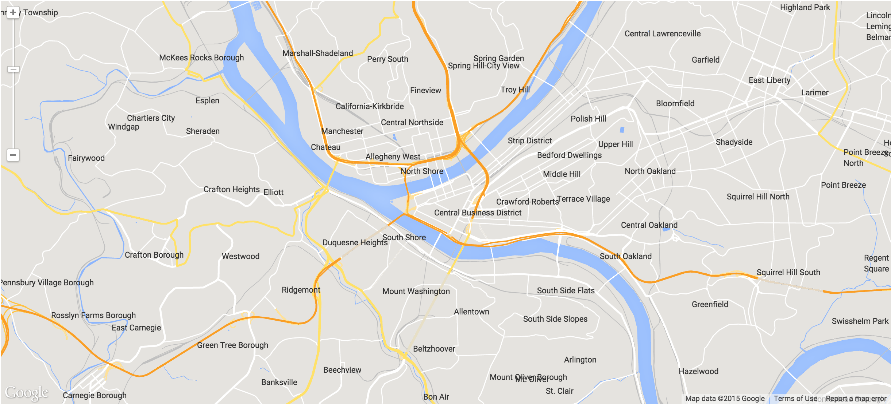
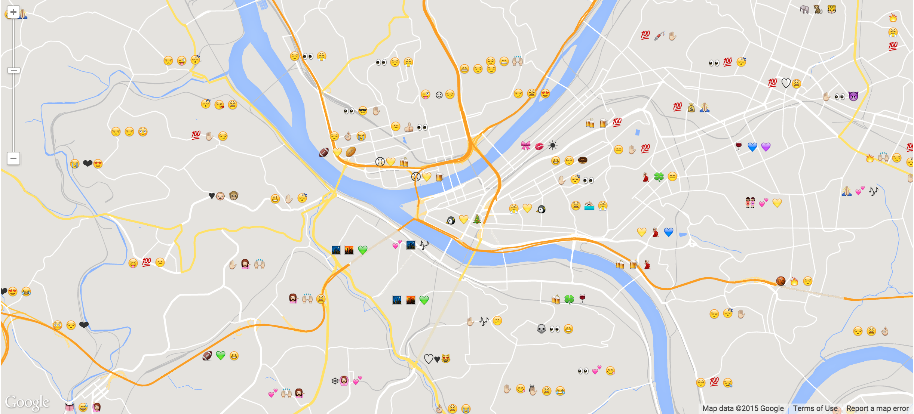
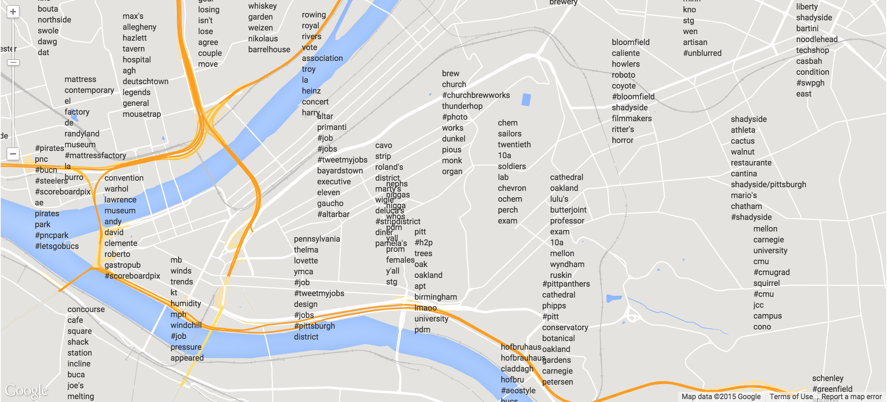

A map of Pittsburgh that displays the top tweeted words and emojis in each neighborhood (computed using TF-IDF).

Click [here](http:/emojimap.herokuapp.com) to go to the live web app!

Some screenshots:

emojitracker\_rankings.json is popularity rankings from http://emojitracker.com/, before Twitter shut it down. We may be able to use this in the future.

To run this:

    git clone (this repo)
    virtualenv env
    source env/bin/activate
    pip install -r requirements.txt
    ./map.py

Then go to localhost:5000 in a browser.
