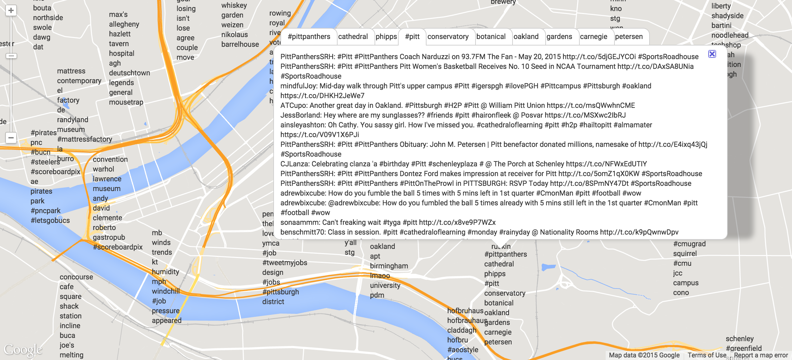

A map of Pittsburgh that displays the top emojis and words that characterize each neighborhood (computed using TF-IDF).

Click [here](http:/emojimap.herokuapp.com) to go to the live web app!

With context AKA a list of tweets with that emoji/word

